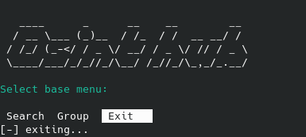

# osint-hub-client

This is the Osint Hub Client

# Install

> Do not forget to create 'key.txt' in "./private/"

# About

Find me on: 
- [npmjs](https://www.npmjs.com/package/osinthub-client)
- [github](https://github.com/Sn0wAlice/osint-hub-client)